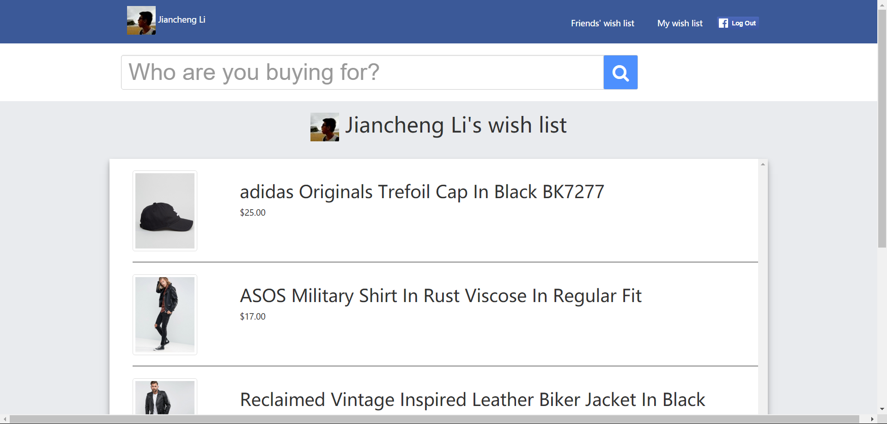
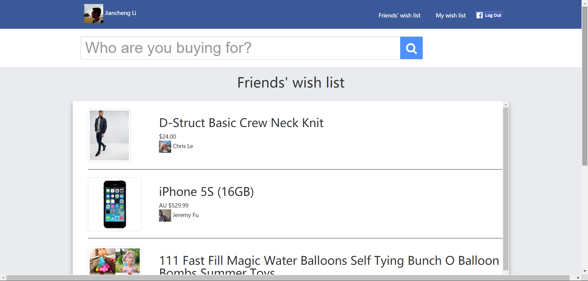
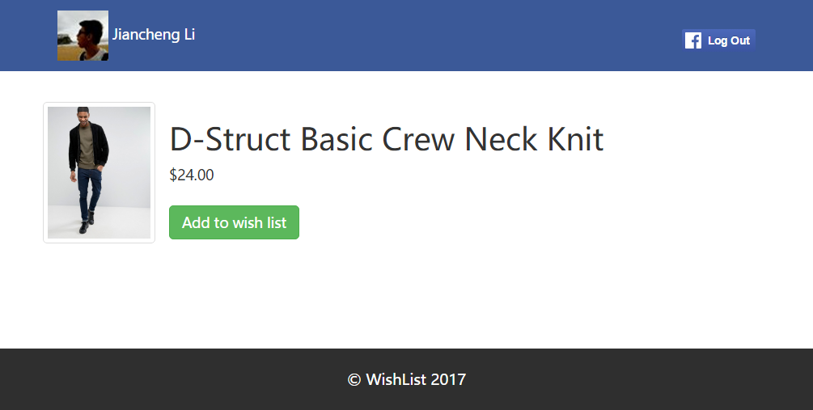

# wishlist

A facebook app that you can add your items into your wish list and checkout your friends' wish lists.

## Disclaimer:

This was built for Facebook Sydney's 2017 Hackathon on the 29th-30th of April 2017. The original git repository that was used during the event is here: https://github.com/lijiancheng0614/wishlist

## Run

1. Upload the codes to a server.

2. Run the scripts below in an item page to add the item.
    
    (You can use tampermonkey extension to run it automatically.)

    ```javascript
    // ==UserScript==
    // @name         New Userscript
    // @namespace    http://tampermonkey.net/
    // @version      0.1
    // @description  try to take over the world!
    // @author       You
    // @match        http://www.asos.com/a*prd*
    // @grant        none
    // ==/UserScript==

    (function() {
        'use strict';

        var input=document.createElement("input");
    input.type="button";
    input.value="Add to FB Wish List";

    input.onclick = showAlert;

    input.setAttribute("style","font-family:Tahoma;color:white;font-size:18px;position:absolute;top:300px;right:280px;background-color:#4a67b8");

    document.body.appendChild(input);
    function showAlert()
    {
        var params = "url=" + window.location.href + "&" +
            "price=" + document.getElementsByClassName('current-price')[0].innerHTML + "&" +
            "img=" + document.getElementsByClassName('gallery-image')[0].currentSrc + "&" +
            "product_name=" + document.getElementsByTagName("h1")[0].innerHTML
            ;

        var html_url = "https://wishlist-70b60.firebaseapp.com/add.html?";

        window.open(html_url + params, "Add to my facebook wish list", "height=480, width=800");
    }
    })();
    ```

## Screenshots






